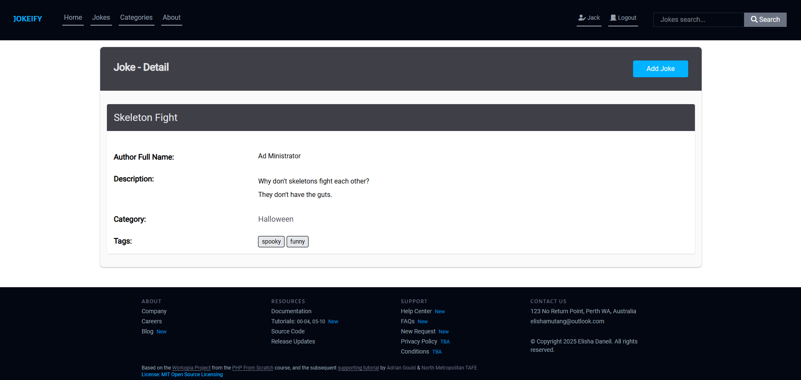

<a name="readme-top" id="readme-top"></a>
# EMD SaaS Vanilla MVC 2025 S1

Base Code for a Vanilla PHP Micro-MVC Framework.

Used by students at North Metropolitan TAFE for learning and assessment purposes.


[![Forks][forks-shield]][forks-url] 
[![Downloads][downloads-shield]][downloads-url] 
[![Issues][issues-shield]][issues-url] 

[![Languages][languages-shield]][languages-url] 
[![PHP][Php.com]][Php-url] 
[![JS][Js.com]][Js-url] 

[![Tailwindcss][Tailwindcss.com]][Tailwindcss-url] 
[![PhpStorm][PhpStorm.com]][PhpStorm-url] 
[![Educational Community Licence][licence-shield]][licence-url] 

<p align="right">(<a href="#readme-top">back to top</a>)</p>


## Definitions

| Term                | Definition                                                                                                                                                             |
|---------------------|------------------------------------------------------------------------------------------------------------------------------------------------------------------------|
| BREAD               | Database operations to Browse, Read, Edit, Add and Delete data                                                                                                         |
| CRUD                | More commonly used term over BREAD. Create (Add), Retrieve (Browse/Read), Update (Edit) and Delete (Delete)                                                            |
| Relational Database | A database structured to recognize relations between stored items of information.                                                                                      |
| One to One          | A one to one relationship is a relationship where a record in one table is associated with exactly one record in another table.                                        |
| One to Many         | A one to many relationship refer to relations where one record on one side of the relation can be connected to zero or more records on the other side.                 |
| Many to Many        | A many to many relationship describes a link between two entities where each instance in one entity can be related to multiple instances in the other, and vice versa. |
| Polymorphism        | Polymorphism describes the concept that you can access objects of different types through the same interface.                                                          |
| MVC                 | A common software architectural pattern that is used to implement user interfaces, data, and controlling logic.                                                        | |

<p align="right">(<a href="#readme-top">back to top</a>)</p>

## Description

Jokeify is a simple jokes system built using HTML, TailwindCSS, PHP, and SQL / MariaDB. The web application
followed the Model-View-Controller Framework to allow for a more organised, scalable, and maintainable application.

Features of the application include user authentication and BREAD (browse, read, edit, add, delete) operations for 
to manage jokes and categories.

This code is based on the [Workopia Project](https://github.com/bradtraversy/workopia-php)
Micro-MVC Framework from the [PHP From Scratch course](https://www.traversymedia.com/php-from-scratch),
and the subsequent [supporting tutorial](https://github.com/AdyGCode/XXX-SaaS-Vanilla-MVC-YYYY-SN/tree/main/session-07)
by [Adrian Gould](https://adygcode.github.io/) & [North Metropolitan TAFE](https://www.northmetrotafe.wa.edu.au/)

<p align="right">(<a href="#readme-top">back to top</a>)</p>

## Table of Contents

TO DO: Add extra, or update the contents as needed, then remove this line.

- [Description](#description)
- [Definitions](#definitions)
- [Installation](#installation)
- [Usage](#usage)
- [Credits](#credits)
- [Features](#features)
- [Tests](#tests)
- [Contact](#contact)
- [Licence](#licence)

## Installation

> **CLI Shell**
>
> Instructions are given using the BASH or Git-BASH CLI only.

> **Default Project Location**
>
> We presume you are using the bash shell within Windows Terminal and have a work folder called
`Source/Repos` in your account's
> root folder (eg. `/c/Users/YourName/Source/Repos`).

### Change directory and clone repo.
```shell
cd $HOME/Source/Repos
git clone https://github.com/elishamutang/EMD-php-mvc-jokes-2025-s1
```

### Change into the folder and run the `composer` and `npm` installers:

```shell
cd EMD-php-mvc-jokes-2025-s1
composer install
composer update
npm install
```

### Install CK Editor, Commonmark and HTML-to-Markdown using:

```shell
composer require ckeditor/ckeditor league/html-to-markdown league/commonmark
npm install @ckeditor/ckeditor5-build-classic
```

### Create RDBMS User & Database

Create the Database, Database user password, plus tables and seed data using MariaDB.

#### MariaDB and MySQL

Using PhpMyAdmin or a similar GUI based MySQL/RDBMS administration interface, execute the
provided SQL file for MariaDB.

#### Links to SQL Script

| DBMS       | User & DB Script                                      |
|------------|-------------------------------------------------------|
| MariaDB    | [database-mariadb.sql](./config/database-mariadb.sql) |


<p align="right">(<a href="#readme-top">back to top</a>)</p>

## Usage

### General Homepage
When first visiting the website, users are greeted with the below homepage which shows a random joke. From here on, they will need to login or register
to see all the jokes and categories.


### General About Page
This page provides the user with an overview of the website, the creator of the website, and the associated technologies / tools that were used to build the website.


### User Login Page
If the user is already registered, they will have to login to access all the jokes and categories, including managing their own created jokes / categories.


### User Registration Page
If the user is not registered, they will need to register their details using the registration form below.


### Authenticated Homepage
After being authenticated, the user is greeted with the following homepage. The homepage shows the statistics for the total number of
Jokes, Categories, and Users in the system. 

In addition, a random joke generator is presented where the user may generate a random joke
by clicking the button.


### Edit User Details
Users will be able to edit their details such as Given Name, Family Name, Nickname, Email, City, State, Country, and Password.


### Jokes Page
The Jokes page shows all the jokes in the system. At this page, each joke shows the following information:

- Title
- Author
- Category
- Tags

In addition, the user will be able to add a new joke while staying on the jokes page.


### Add New Joke
If the user wants to add a new joke, they must click the "Add Joke" button from the previous page. The user will be presented with the following form.


### Read Joke
By clicking the "More Details" button on each joke from the Jokes page, the user will be presented with more information regarding
the joke such as:

- Author Full Name
- Description / Body of joke
- Category
- Tags




### Read Own Joke
If a user is reading their own joke, they will have access to either Edit or Delete the joke.


### Edit Joke
If the user wants to edit their own joke, they will be able to do so and is presented with the following page as an example.


### Delete Joke
If the user wants to delete their own joke, they will be presented with a confirmation pop-up to confirm the deletion of their joke from the system.


### Search Joke
The user will be able to search for jokes using the Search Bar at the top right of the "header" / navigation bar. Below is an example of
the possible results from what was searched using the search bar.


### Categories Page
Below is the Categories page that shows all the categories associated with the jokes in the system. Users will be able to browse and read
the categories from this page. Users may manage the categories they created (identified by You tag) or add new ones.


### Read Category
Users may access additional information regarding a category by clicking the "More Details" button from the previous page (Categories page).
The following information is presented:

- Title
- Author Name
- Creation date
- Last updated date
- Jokes belonging to the category

Users can click on the related jokes which will direct them to that specific joke. In addition, users may add new categories by clicking on the "Add Category" button.


### Add Category
Users will be directed to a page where they can create their own categories.


### Read Own Category
Users may Edit or Delete their own categories.


### Edit Category
Users may edit their own categories by changing the title of the category to something else.


### Delete Category
Users will be presented with a confirmation pop-up to confirm their deletion of the category from the system.


### Search Category
Users will be able to search for a specific category using the Category Search bar.


<p align="right">(<a href="#readme-top">back to top</a>)</p>

## Credits
 
- Font Awesome. (n.d.). Fontawesome.com. https://fontawesome.com
- PHP: Hypertext Preprocessor. (n.d.). www.php.net. https://php.net
- TailwindCSS. (2023). Tailwind CSS - Rapidly build modern websites
  without ever leaving your HTML. Tailwindcss.com. https://tailwindcss.com/
- JetBrains (2019). PhpStorm. [online] JetBrains. Available
  at: https://www.jetbrains.com/phpstorm/.
- html-to-markdown: Convert HTML to Markdown with PHP. (n.d.). 
  GitHub. https://github.com/thephpleague/html-to-markdown
- CommonMark: A strongly defined, highly compatible specification of Markdown. (2004). https://commonmark.org/


<p align="right">(<a href="#readme-top">back to top</a>)</p>

## Features

- User authentication, login, and logout.
- Jokes and category management using BREAD (Browse, Read, Edit, Add, Delete) operations.
- Registered and authenticated users may add, edit and delete jokes and categories they have created.
- Registered and authenticated users may edit their own user data only.

<p align="right">(<a href="#readme-top">back to top</a>)</p>

## Tests

| Feature    | Sub-Feature     | Test Data                                                                                                                                                                                  | Expected Result                                                                                                                                                                                                                                                                                | Actual Result                | Notes |
|------------|-----------------|--------------------------------------------------------------------------------------------------------------------------------------------------------------------------------------------|------------------------------------------------------------------------------------------------------------------------------------------------------------------------------------------------------------------------------------------------------------------------------------------------|------------------------------|-------|
| Users      | Login           | email: user1@example.com<br>password: Password1                                                                                                                                            | Returns to home page<br>Login/Register replaced with Logout                                                                                                                                                                                                                                    | Same as expected<br/>result. |       |
|            | Login           | email: user1@example.com<br>password:                                                                                                                                                      | Displays error as no password provided                                                                                                                                                                                                                                                         | Same as expected<br/>result. |       |
|            | Login           | email: <br>password: Password1                                                                                                                                                             | Displays an error as no email provided                                                                                                                                                                                                                                                         | Same as expected<br/>result. |       |
|            | -----------     |                                                                                                                                                                                            |                                                                                                                                                                                                                                                                                                |                              |       |
|            | Register        | Given Name: Jack<br/>Family Name: Smith<br/>Nickname: <br/>Email: jacksmith@example.com<br/>City: <br/>State: <br/>Country: <br/>Password: password1234<br/>Confirm Password: password1234 | Returns to home page<br/>Login/Register replaced with Logout.<br/>Nickname is replaced with Given Name.<br/>City, state, country will be filled with UNKNOWN by default.                                                                                                                       | Same as expected<br/>result. |       |
|            | Register        | Given Name: <br/>Family Name: Smith<br/>Nickname: <br/>Email: <br/>City: <br/>State: <br/>Country: <br/>Password: <br/>Confirm Password:                                                   | Displays an error for given name, email, and password since not provided.                                                                                                                                                                                                                      | Same as expected<br/>result. |       |
|            | -----------     |                                                                                                                                                                                            |                                                                                                                                                                                                                                                                                                |                              |       |
|            | Logout          |                                                                                                                                                                                            | Logs user out and returns to login page.                                                                                                                                                                                                                                                       | Same as expected<br/>result. |       |
| --------   | -----------     |                                                                                                                                                                                            |                                                                                                                                                                                                                                                                                                |                              |       |
| Jokes      | Read Joke       |                                                                                                                                                                                            | Shows detailed information of joke.<br/>User is able to manage joke if user is reading own joke.                                                                                                                                                                                               | Same as expected<br/>result. |       |
|            | Add Joke        | Title: Hello<br/>Author: Jack Smith<br/>Description: Testing testing 123<br/>Category: Unknown<br/>Tags: joke,pun                                                                          | Returns to Jokes page, with newly added joke visible on page.                                                                                                                                                                                                                                  | Same as expected<br/>result. |       |
|            | Add Joke        | Title: <br/>Author: Jack Smith<br/>Description: <br/>Category: Unknown<br/>Tags:                                                                                                           | Displays an error for title, description, and tags since not provided.                                                                                                                                                                                                                         | Same as expected<br/>result. |       |
|            | Add Joke        | Title: Hello<br/>Author: Jack Smith<br/>Description: This is not a drill<br/>Category: Unknown<br/>Tags: joke,pun                                                                          | Displays error because joke titled 'Hello' is a duplicate in the system.                                                                                                                                                                                                                       | Same as expected<br/>result. |       |
|            | Edit Joke       | Title: Hello<br/>Author: Jack Smith<br/>Description: Testing testing 123<br/>Category: Unknown<br/>Tags: joke,pun                                                                          | Returns to Jokes page, with updated joke visible on page.                                                                                                                                                                                                                                      | Same as expected<br/>result. |       |
|            | Edit Joke       | Title: <br/>Author: Jack Smith<br/>Description: <br/>Category: Unknown<br/>Tags:                                                                                                           | Displays an error for title, description, and tags since not provided.                                                                                                                                                                                                                         | Same as expected<br/>result. |       |                                                                                                                                                                                             
|            | Edit Joke       | Title: Hello<br/>Author: Jack Smith<br/>Description: Testing testing 123<br/>Category: Unknown<br/>Tags: joke,pun                                                                          | Displays an error because joke titled 'Hello' is a duplicate in the system.                                                                                                                                                                                                                    | Same as expected<br/>result. |       |
|            | Delete Joke     |                                                                                                                                                                                            | Shows a pop-up that confirms the deletion of the joke from the system.<br/>If user clicks on 'Confirm' then the joke is deleted from the system and the user is directed to the Jokes page.<br/>If the user clicks on 'Cancel' then the pop-up closes and joke still remains.                  | Same as expected<br/>result. |       |
|            | Search Joke     | Search joke: a                                                                                                                                                                             | Filters out jokes that contain 'a' in the joke body / description.                                                                                                                                                                                                                             | Same as expected<br/>result. |       |
| --------   | -----------     |                                                                                                                                                                                            |                                                                                                                                                                                                                                                                                                |                              |       |
| Categories | Read Category   |                                                                                                                                                                                            | Shows detailed information of category.<br/>User able to manage category if user is reading own category.                                                                                                                                                                                      | Same as expected<br/>result. |       |
|            | Add Category    | Title: geekers                                                                                                                                                                             | Returns to Categories page, with newly added category visible to page.                                                                                                                                                                                                                         | Same as expected<br/>result. |       |
|            | Add Category    | Title:                                                                                                                                                                                     | Displays an error as no category title provided.                                                                                                                                                                                                                                               | Same as expected<br/>result. |       |
|            | Add Category    | Title: geekers                                                                                                                                                                             | Displays an error since geekers is a duplicate in the system.                                                                                                                                                                                                                                  | Same as expected<br/>result. |       |
|            | Edit Category   | Title: geekerz                                                                                                                                                                             | Returns to Categories page, with newly updated category visible to page.                                                                                                                                                                                                                       | Same as expected<br/>result. |       |
|            | Edit Category   | Title:                                                                                                                                                                                     | Displays an error as no category title provided.                                                                                                                                                                                                                                               |                              |       |
|            | Delete Category |                                                                                                                                                                                            | Shows a pop-up that confirms the deletion of the category from the system.<br/>If user clicks on 'Confirm' then the category is deleted from the system and the user is directed to the Categories page.<br/>If the user clicks on 'Cancel' then the pop-up closes and category still remains. | Same as expected<br/>result. |       |
|            | Search Category | Search category: a                                                                                                                                                                         | Filters out categories that contain 'a' in the category title.                                                                                                                                                                                                                                 |                              |       |                                                                                                                                                                                                                                                                                                |                              |       |


<p align="right">(<a href="#readme-top">back to top</a>)</p>

## Contact

Elisha Mutang Daneil - 20145565@tafe.wa.edu.au

Project Link: https://github.com/elishamutang/EMD-php-mvc-jokes-2025-s1

<p align="right">(<a href="#readme-top">back to top</a>)</p>

## Licence

Please see the [Educational Community License](License.md) for more details.

Any code based upon this project must also give the appropriate credit
both in the source code and also on any associated promotional, educational,
corporate or other materials both digital and non-digital.


<p align="right">(<a href="#readme-top">back to top</a>)</p>

## References & Further Study

- Font Awesome. (n.d.). Fontawesome.com. https://fontawesome.com
- PHP: Hypertext Preprocessor. (n.d.). www.php.net. https://php.net
- TailwindCSS. (2023). Tailwind CSS - Rapidly build modern websites
  without ever leaving your HTML. Tailwindcss.com. https://tailwindcss.com/
- JetBrains (2019). PhpStorm. [online] JetBrains. Available
  at: https://www.jetbrains.com/phpstorm/.
- html-to-markdown: Convert HTML to Markdown with PHP. (n.d.).
  GitHub. https://github.com/thephpleague/html-to-markdown
- CommonMark: A strongly defined, highly compatible specification of Markdown. (2004). https://commonmark.org/
- Workopia Project: PHP From Scratch. Brad Traversy. (2023). https://github.com/bradtraversy/workopia-php


<!-- MARKDOWN LINKS & IMAGES -->
<!-- https://www.markdownguide.org/basic-syntax/#reference-style-links -->

[forks-shield]: http://img.shields.io/github/forks/adygcode/xxx-saas-vanilla-mvc-yyyy-sn.svg?style=for-the-badge

[forks-url]: https://github.com/AdyGCode/xxx-saas-vanilla-mvc-yyyy-sn/network/members

[languages-shield]: http://img.shields.io/github/languages/count/adygcode/xxx-saas-vanilla-mvc-yyyy-sn.svg?style=for-the-badge

[languages-url]: https://github.com/AdyGCode/xxx-saas-vanilla-mvc-yyyy-sn/network/members

[downloads-shield]: http://img.shields.io/github/downloads/adygcode/xxx-saas-vanilla-mvc-yyyy-sn/total?style=for-the-badge

[downloads-url]: https://github.com/AdyGCode/xxx-saas-vanilla-mvc-yyyy-sn/network/members

[issues-shield]: http://img.shields.io/github/issues/adygcode/xxx-saas-vanilla-mvc-yyyy-sn.svg?style=for-the-badge

[issues-url]: https://github.com/adygcode/xxx-saas-vanilla-mvc-yyyy-sn/issues

[licence-shield]: https://img.shields.io/badge/opensourceinitiative-3DA639?style=for-the-badge&logoColor=black

[licence-url]: https://github.com/adygcode/xxx-saas-vanilla-mvc-yyyy-sn/blob/main/License.md

[product-screenshot]: images/screenshot.png

[Laravel.com]: https://img.shields.io/badge/Laravel-FF2D20?style=for-the-badge&logo=laravel&logoColor=white

[Laravel-url]: https://laravel.com

[Tailwindcss.com]: https://img.shields.io/badge/Tailwindcss-06B6D4?style=for-the-badge&logo=tailwindcss&logoColor=white&labelColor=black

[Tailwindcss-url]: https://tailwindcss.com

[Livewire.com]: https://img.shields.io/badge/Livewire-4E56A6?style=for-the-badge&logo=livewire&logoColor=white

[Livewire-url]: https://livewire.laravel.com

[Inertia.com]: https://img.shields.io/badge/Inertia-9553E9?style=for-the-badge&logo=inertia&logoColor=white

[Inertia-url]: https://inertiajs.com

[Php.com]: https://img.shields.io/badge/Php-777BB4?style=for-the-badge&logo=php&logoColor=white&labelColor=black

[Php-url]: https://inertiajs.com

[PhpStorm.com]: https://img.shields.io/badge/Phpstorm-000000?style=for-the-badge&logo=phpstorm&logoColor=white&labelColor=black

[PhpStorm-url]: https://jetbrains.com/phpstorm/

[Js.com]: https://img.shields.io/badge/JavaScript-F7DF1E?style=for-the-badge&logo=javascript&logoColor=white&labelColor=black

[Js-url]: https://developer.mozilla.org/en-US/docs/Web/JavaScript
